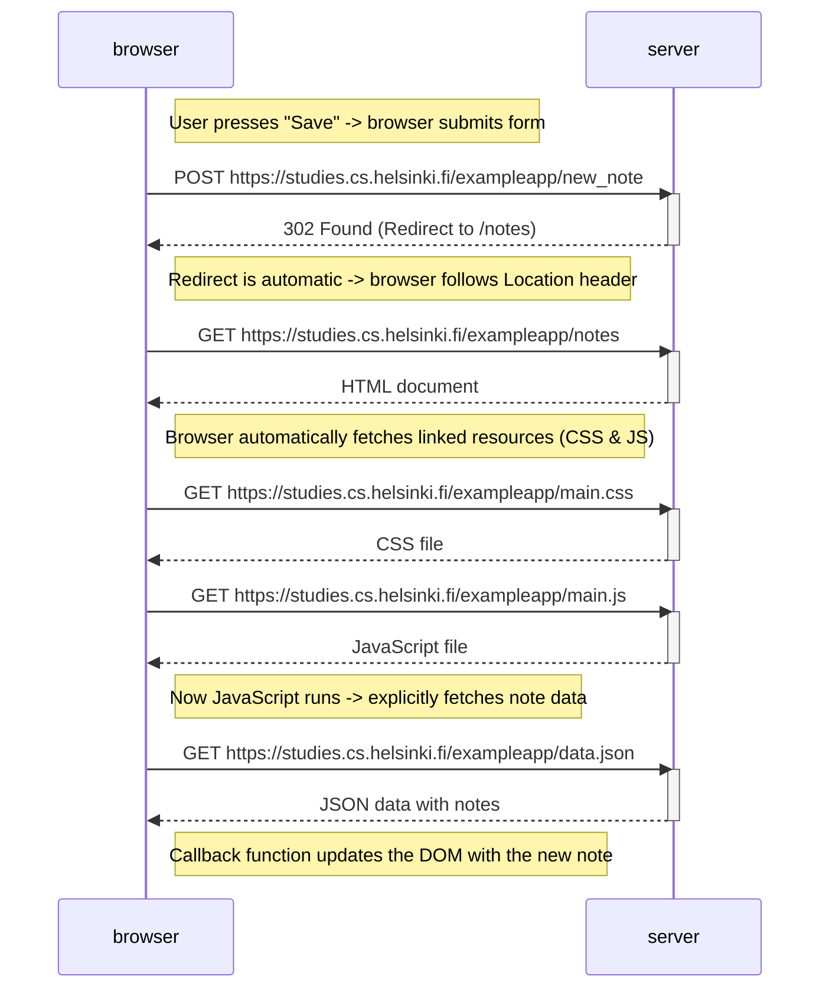

```mermaid 
sequenceDiagram
    participant browser
    participant server

    Note right of browser: User presses "Save" -> browser submits form

    browser->>server: POST https://studies.cs.helsinki.fi/exampleapp/new_note
    activate server
    server-->>browser: 302 Found (Redirect to /notes)
    deactivate server

    Note right of browser: Redirect is automatic -> browser follows Location header

    browser->>server: GET https://studies.cs.helsinki.fi/exampleapp/notes
    activate server
    server-->>browser: HTML document
    deactivate server

    Note right of browser: Browser automatically fetches linked resources (CSS & JS)

    browser->>server: GET https://studies.cs.helsinki.fi/exampleapp/main.css
    activate server
    server-->>browser: CSS file
    deactivate server

    browser->>server: GET https://studies.cs.helsinki.fi/exampleapp/main.js
    activate server
    server-->>browser: JavaScript file
    deactivate server

    Note right of browser: Now JavaScript runs -> explicitly fetches note data

    browser->>server: GET https://studies.cs.helsinki.fi/exampleapp/data.json
    activate server
    server-->>browser: JSON data with notes
    deactivate server

    Note right of browser: Callback function updates the DOM with the new note

``` 